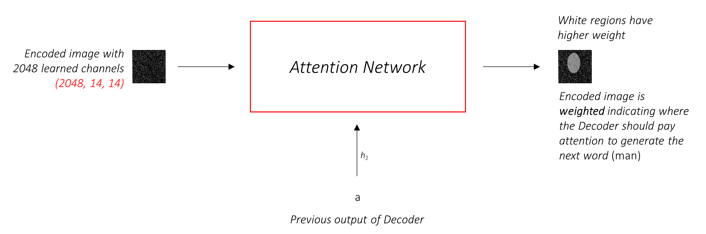

# image captioning with pytorch

**To build a model that can generate a descriptive caption for an image we provide it.**

In this repo we are implementing image captioning model from [Show, Attend and Tell: Neural Image Caption
Generation with Visual Attention](https://arxiv.org/abs/1502.03044v3) paper.

# Overview

In this section, I will present an overview of this model. 

### Encoder

The Encoder **encodes the input image with 3 color channels into a smaller image with "learned" channels**.

This smaller encoded image is a summary representation of all that's useful in the original image.

Since we want to encode images, we use Convolutional Neural Networks (CNNs).

For years, people have been building models that are extraordinarily good at classifying an image into one of a thousand categories. It stands to reason that these models capture the essence of an image very well.

I have chosen to use the **101 layered Residual Network trained on the ImageNet classification task**, already available in PyTorch. As stated earlier, this is an example of Transfer Learning. You have the option of fine-tuning it to improve performance.


These models progressively create smaller and smaller representations of the original image, and each subsequent representation is more "learned", with a greater number of channels. The final encoding produced by our ResNet-101 encoder has a size of 14x14 with 2048 channels, i.e., a `2048, 14, 14` size tensor.

I encourage you to experiment with other pre-trained architectures. The paper uses a VGGnet, also pretrained on ImageNet, but without fine-tuning. Either way, modifications are necessary. Since the last layer or two of these models are linear layers coupled with softmax activation for classification, we strip them away.

### Decoder

The Decoder's job is to **look at the encoded image and generate a caption word by word**.

Since it's generating a sequence, it would need to be a Recurrent Neural Network (RNN). We will use an LSTM.

In a typical setting without Attention, you could simply average the encoded image across all pixels. You could then feed this, with or without a linear transformation, into the Decoder as its first hidden state and generate the caption. Each predicted word is used to generate the next word.


In a setting _with_ Attention, we want the Decoder to be able to **look at different parts of the image at different points in the sequence**. For example, while generating the word `football` in `a man holds a football`, the Decoder would know to focus on – you guessed it – the football!


Instead of the simple average, we use the _weighted_ average across all pixels, with the weights of the important pixels being greater. This weighted representation of the image can be concatenated with the previously generated word at each step to generate the next word.

### Attention

The Attention network **computes these weights**.

Intuitively, how would you estimate the importance of a certain part of an image? You would need to be aware of the sequence you have generated _so far_, so you can look at the image and decide what needs describing next. For example, after you mention `a man`, it is logical to declare that he is `holding a football`.

This is exactly what the Attention mechanism does – it considers the sequence generated thus far, and _attends_ to the part of the image that needs describing next.



We will use _soft_ Attention, where the weights of the pixels add up to 1. If there are `P` pixels in our encoded image, then at each timestep `t` –

<p align="center">

</p>

You could interpret this entire process as computing the **probability that a pixel is _the_ place to look to generate the next word**.

### Putting it all together

It might be clear by now what our combined network looks like.


- Once the Encoder generates the encoded image, we transform the encoding to create the initial hidden state `h` (and cell state `C`) for the LSTM Decoder.
- At each decode step,
  - the encoded image and the previous hidden state is used to generate weights for each pixel in the Attention network.
  - the previously generated word and the weighted average of the encoding are fed to the LSTM Decoder to generate the next word.

### overview is from [this](https://github.com/sgrvinod/a-PyTorch-Tutorial-to-Image-Captioning) repo

# Usage 

### 1. Clone the repositories.
```bash
$ git clone https://github.com/ARHPA/image_captioning_with_pytorch.git
```

### 2. Download and unzip the dataset from official url of COCO: https://cocodataset.org/#download.

```bash
$ chmod +x download_and_unzip_datasets.csh
$ ./download_and_unzip_datasets.csh
```

### 3. Train model for image captioning.

```bash
$ python train.py
```
